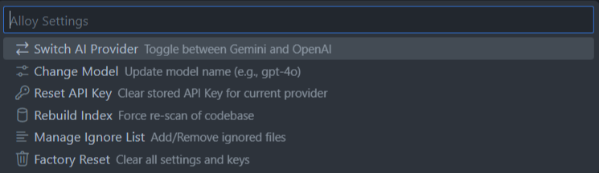

# Alloy AI

Alloy AI is a VS Code extension for debugging and code understanding with workspace-aware AI assistance.

Instead of manually collecting logs and context, Alloy gathers terminal output, diagnostics, and related files, then proposes targeted fixes.

## Why Alloy

- Capture issues directly from your active terminal and the Problems panel.
- Trace root causes across files using a local codebase index.
- Apply AI-generated multi-file fixes without leaving VS Code.
- Explain code and debug workflows from an integrated chat view.

## Core Features

- **Automated error capture**
  - Reads active terminal output.
  - Aggregates compiler/linter diagnostics from Problems.
- **Crash + logic error workflows**
  - Fixes explicit runtime/build errors.
  - If no clear logs exist, supports manual bug descriptions (expected vs actual behavior) for logic issues.
  - Can run your reproduce command with timeout-aware handling for interactive/long-running apps.
- **Cross-file root-cause context**
  - Detects referenced files from logs.
  - Uses a local indexed dependency/symbol graph to retrieve relevant files.
- **Integrated Debug Chat**
  - Dedicated sidebar chat view.
  - File attachment support for ad hoc context.
  - Agent loop can search the codebase context and apply edits.
- **Provider flexibility**
  - Supports **Google Gemini**, **OpenAI**, and **Claude**.
  - Stores provider-specific API keys and model preferences in VS Code extension state.
- **Project control**
  - Manage custom ignore patterns.
  - Re-index codebase on demand.
  - Reset provider/model/key settings or perform a full factory reset.

## Installation

Install from VS Code Marketplace:

https://marketplace.visualstudio.com/items?itemName=aditya-anand.alloyai

## Quick Start

1. Open your project in VS Code.
2. Run `Alloy: Fix Error` or `Alloy: Explain Code` from the Command Palette.
3. Select your AI provider on first run.
4. Enter your provider API key when prompted.
5. Review Alloy’s explanation and apply suggested changes.

## Commands

- `Alloy: Fix Error` (`alloyai.fixError`)
- `Alloy: Explain Code` (`alloyai.explainCode`)
- `Alloy: Reset Settings` (`alloyai.resetSettings`)
- `Alloy: Manage Ignore List` (`alloyai.manageIgnores`)
- `Alloy: Open Debug Chat` (`alloyai.openChat`)

## Settings and Controls

`Alloy: Reset Settings` provides:

- Switch AI provider
- Change model
- Update API key
- Manage ignore list
- Re-index codebase
- Factory reset



## How Context and Privacy Work

- Codebase indexing runs locally in your workspace.
- Alloy sends only the assembled request context needed for the current task (active code, relevant indexed files, logs, and any files you attach).
- You can exclude files/folders with custom ignore rules.

## Requirements

- VS Code
- API key for one of:
  - Google Gemini
  - OpenAI
  - Claude (Anthropic)

## Development

```bash
npm install
npm run compile
```

Useful scripts:

- `npm run compile`
- `npm run watch`
- `npm run lint`
- `npm test`

## Changelog

See `CHANGELOG.md` for release notes.
